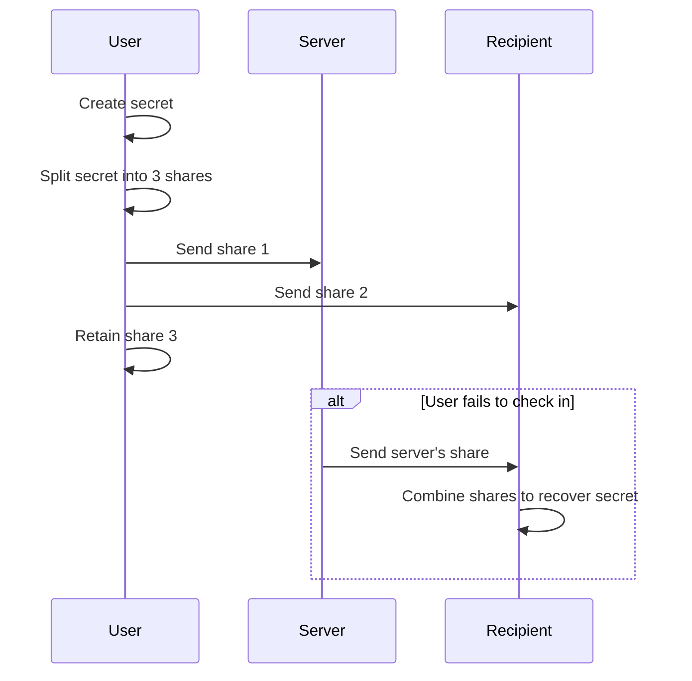
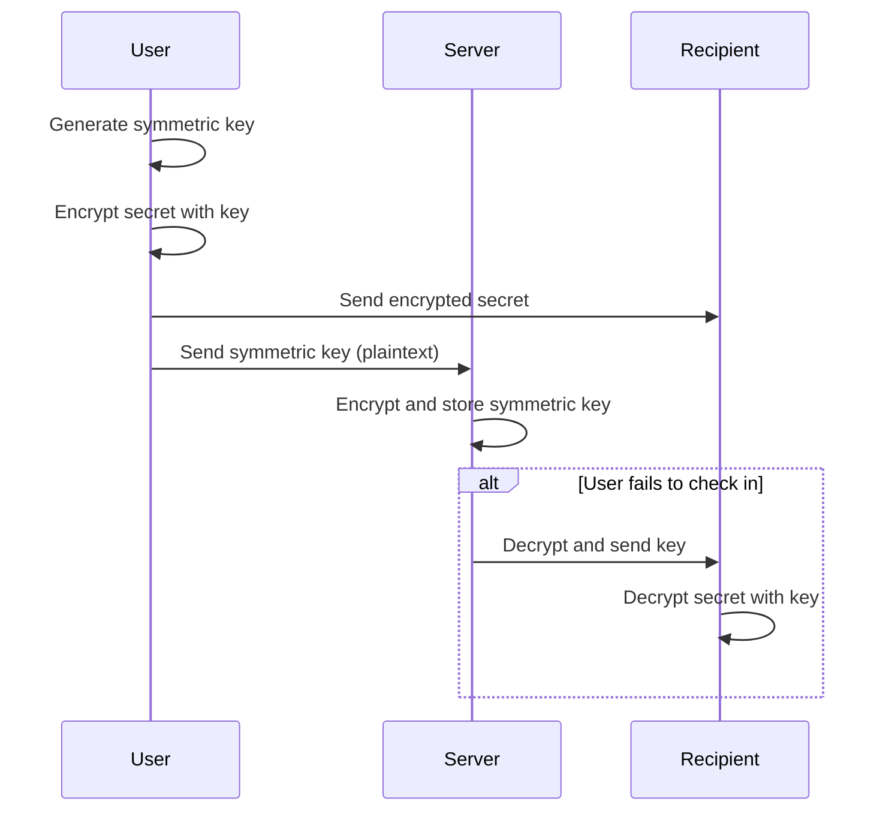

# Secret Storage

## Shamir's Key Sharing (the chosen implementation)

- A 2-of-3 key scheme
- One of the three parties is the server
- The other 2 parties can be
  - Two recipients OR
  - The original sender and one recipient

### Visual Flow for Shamir's

```flow
User (browser)
   |
   |--[1. Create secret & split into 3 shares (Shamir's)]-->
   |         |                    |
   |         |                    |
   |         |                    |
   v         v                    v
Sender   Server              Recipient
   |         |                    |
   |         |--[2. On check-in failure, send share to recipient]-->
   |                              |
   |<--------[3. Recipient combines 2 shares to recover secret]--->|
```

### Mermaid Sequence Diagram for Shamir's



### Pros of Shamir's

- Server alone cannot decrypt the message
- Even if the server is compromised, attacker cannot reconstruct the secret without another share
- Can support more complex trust models (e.g., multiple recipients, notary, etc.)
- Flexible: supports multiple recipients, escrow/notary, threshold security (e.g., 2-of-3, 3-of-5), redundancy, multi-factor, and time-locked recovery

### Cons / Flaws of Shamir's

- More complex key management for users and recipients
- If any required share is lost, the secret is unrecoverable
- If the server colludes with one party, they can reconstruct the secret early
- Requires secure delivery and storage of shares to all parties
- If the sender is incapacitated and only the server and recipient have shares, recovery is possible, but if the recipient loses their share, recovery is impossible

## Hybrid Approach (will not be used, but keeping for reference)

### Steps

- Encrypt message with new symmetric key (client-side)
- User sends the symmetric key (plaintext) to the server
- Server encrypts and stores the symmetric key
- Immediately send encrypted message to recipient
- Do NOT store any logs of the encrypted message (only metadata)
- When user fails to check in, the server decrypts and sends the decryption key to the recipient

### Visual Flow for Hybrid

```flow
User (browser)
   |
   |--[1. Generate symmetric key & encrypt secret]-->
   |
   |--[2. Send encrypted secret to recipient]-->
   |
   |--[3. Send symmetric key (plaintext) to server]-->
Server
   |
   |--[4. Encrypt and store symmetric key]
   |
   |--[5. On check-in failure, decrypt and send key to recipient]-->
Recipient
   |
   |--[6. Combine encrypted secret + key to decrypt]
```

### Mermaid Sequence Diagram for Hybrid



### Pros of Hybrid

- Server never stores plaintext secrets
- Cannot recover secrets if server is hacked (unless key release logic is also compromised)
- Simple for most users: recipient just needs encrypted message and key

### Cons / Flaws of Hybrid

- If recipient loses the encrypted message, they cannot recover the secret even if they get the key
- If the server is compromised at the moment of key release, attacker could intercept the key
- If the server is malicious, it could release the key early (insider risk)
- Recipient must know how to combine the encrypted message and key (usability issue, but can be solved with a web UI or CLI)
- If the user wants to update or revoke a secret, must ensure old keys/messages are not accessible

## General Considerations

- Both approaches require careful UX to ensure recipients understand how to recover secrets
- Both require secure delivery of keys/shares to recipients (email/SMS is not always secure)
- Both require robust metadata management to avoid accidental disclosure or loss

Reference:

- [Mermaid Sequence Diagram Syntax](https://mermaid.js.org/syntax/sequenceDiagram.html)
- [Mermaid Live Editor](https://mermaid.live/edit)
