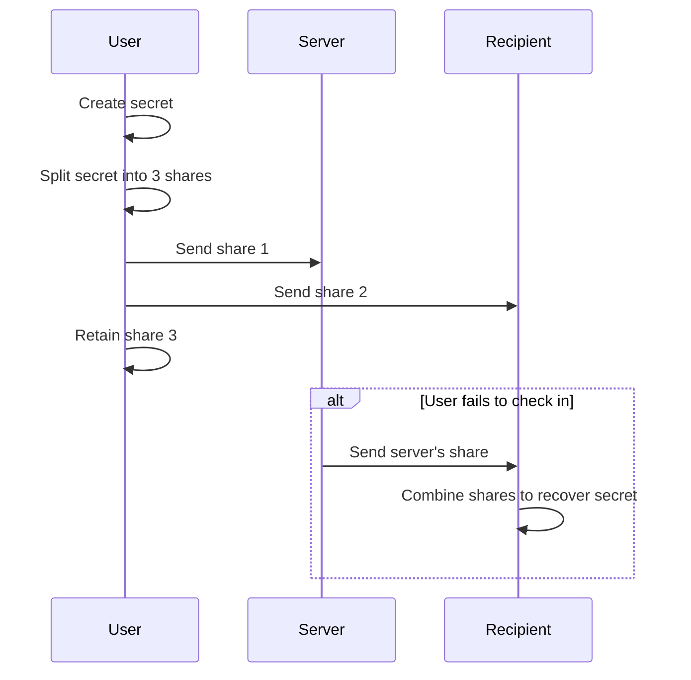
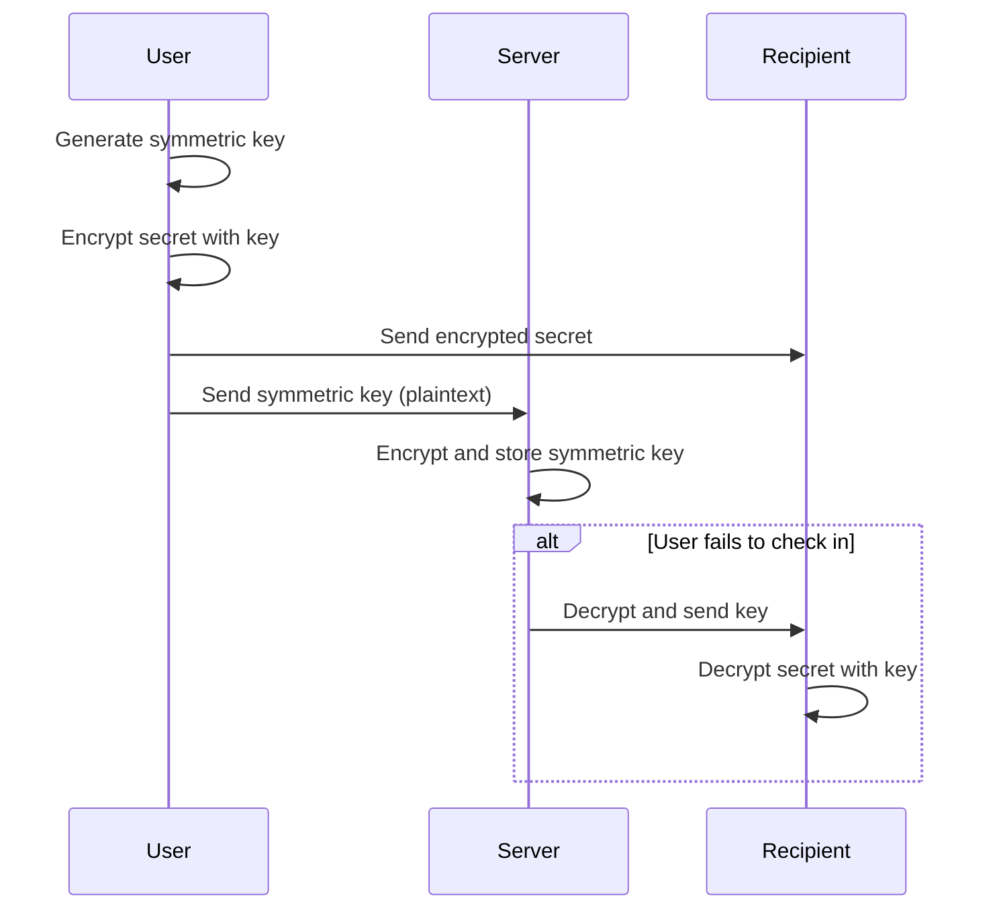

# Secret Storage

## Shamir's Key Sharing (the chosen implementation)

- A 2-of-3 key scheme
- One of the three parties is the server
- The other 2 parties can be
  - Two recipients OR
  - The original sender and one recipient

### Visual Flow for Shamir's

```flow
User (browser)
   |
   |--[1. Create secret & split into 3 shares (Shamir's)]-->
   |         |                    |
   |         |                    |
   |         |                    |
   v         v                    v
Sender   Server              Recipient
   |         |                    |
   |         |--[2. On check-in failure, send share to recipient]-->
   |                              |
   |<--------[3. Recipient combines 2 shares to recover secret]--->|
```

### Mermaid Sequence Diagram for Shamir's



### Pros of Shamir's

- Server alone cannot decrypt the message
- Even if the server is compromised, attacker cannot reconstruct the secret without another share
- Can support more complex trust models (e.g., multiple recipients, notary, etc.)
- Flexible: supports multiple recipients, escrow/notary, threshold security (e.g., 2-of-3, 3-of-5), redundancy, multi-factor, and time-locked recovery

### Cons / Flaws of Shamir's

- More complex key management for users and recipients
- If any required share is lost, the secret is unrecoverable
- If the server colludes with one party, they can reconstruct the secret early
- Requires secure delivery and storage of shares to all parties
- If the sender is incapacitated and only the server and recipient have shares, recovery is possible, but if the recipient loses their share, recovery is impossible

## Hybrid Approach (will not be used, but keeping for reference)

### Steps

- Encrypt message with new symmetric key (client-side)
- User sends the symmetric key (plaintext) to the server
- Server encrypts and stores the symmetric key
- Immediately send encrypted message to recipient
- Do NOT store any logs of the encrypted message (only metadata)
- When user fails to check in, the server decrypts and sends the decryption key to the recipient

### Visual Flow for Hybrid

```flow
User (browser)
   |
   |--[1. Generate symmetric key & encrypt secret]-->
   |
   |--[2. Send encrypted secret to recipient]-->
   |
   |--[3. Send symmetric key (plaintext) to server]-->
Server
   |
   |--[4. Encrypt and store symmetric key]
   |
   |--[5. On check-in failure, decrypt and send key to recipient]-->
Recipient
   |
   |--[6. Combine encrypted secret + key to decrypt]
```

### Mermaid Sequence Diagram for Hybrid



### Pros of Hybrid

- Server never stores plaintext secrets
- Cannot recover secrets if server is hacked (unless key release logic is also compromised)
- Simple for most users: recipient just needs encrypted message and key

### Cons / Flaws of Hybrid

- If recipient loses the encrypted message, they cannot recover the secret even if they get the key
- If the server is compromised at the moment of key release, attacker could intercept the key
- If the server is malicious, it could release the key early (insider risk)
- Recipient must know how to combine the encrypted message and key (usability issue, but can be solved with a web UI or CLI)
- If the user wants to update or revoke a secret, must ensure old keys/messages are not accessible

## General Considerations

- Both approaches require careful UX to ensure recipients understand how to recover secrets
- Both require secure delivery of keys/shares to recipients (email/SMS is not always secure)
- Both require robust metadata management to avoid accidental disclosure or loss

Reference:

- [Mermaid Sequence Diagram Syntax](https://mermaid.js.org/syntax/sequenceDiagram.html)
- [Mermaid Live Editor](https://mermaid.live/edit)

## Shamir's Implementation Progress (KeyFate)

This section details the actual implementation choices and progress for using Shamir's Secret Sharing as the sole method for KeyFate.

### Core Flow Implemented

1. **Secret Creation (Client-Side Logic in `NewSecretForm.tsx`):
    - User inputs their raw secret message, recipient details, trigger deadline, and SSS parameters (total shares N, threshold T).
    - The SSS parameters (N, T) are configurable by the user (default N=3, T=2; min N=2, min T=2, max N/T=10; T <= N).
    - The raw secret is **never sent to the server**.
    - Client-side, the `shamirs-secret-sharing` library splits the secret message into N shares.
    - `share[0]` is designated as the server's share.
    - This `share[0]` (hex-encoded) is then client-side encrypted using `encryptMessage` (AES-256-GCM) which utilizes an environment-defined `ENCRYPTION_KEY`.
    - The client sends the encrypted `share[0]`, its IV, its authTag, and all other secret metadata (title, recipient info, SSS parameters N & T, etc.) to the `/api/secrets` backend.
2. **Secret Storage (Backend Logic in `/api/secrets/route.ts`):
    - The API receives the client-encrypted server share and its cryptographic elements (IV, authTag).
    - It stores this encrypted share directly in the `secrets` table (`server_share` column) along with `iv`, `auth_tag`, `sss_shares_total`, and `sss_threshold`.
    - The API returns the `secretId` of the newly created record.
3. **Share Management UI (Client-Side in `/secrets/[id]/share-instructions/page.tsx`):
    - After successful secret creation, the user is redirected to a dedicated share instructions page.
    - This page receives the `secretId` and a JSON array of all *user-managed shares* (i.e., original `share[1]` through `share[N-1]`, hex-encoded) via URL query parameters.
    - It displays:
            * "Your Personal Share" (which is `original_shares[1]`).
    - "Primary Recipient's Share" (which is `original_shares[2]`, intended for the main named recipient).
    - "Additional Distributable Share X" for any further shares (e.g., `original_shares[3]`, `original_shares[4]`, etc.) if N > 3.
    - Each displayed share has a copy-to-clipboard button.
    - Clear instructions are provided on the importance of each share and the necessity of securely distributing the recipient(s) shares.
    - A `mailto:` link is provided for the primary recipient's share.
    - The user must check a confirmation box stating they have securely distributed/stored the shares before they can proceed to the dashboard.

### Key Components & Files

- **SSS Library**: `jwerle/shamirs-secret-sharing`
- **Encryption Library (for server's share)**: Node.js `crypto` (AES-256-GCM via `encryptMessage`/`decryptMessage` in `frontend/src/lib/encryption.ts`)
- **New Secret Form**: `frontend/src/components/forms/newSecretForm.tsx`
- **Secret Creation API**: `frontend/src/app/api/secrets/route.ts`
- **Share Instructions Page**: `frontend/src/app/(authenticated)/secrets/[id]/share-instructions/page.tsx`
- **Zod Schema for Validation**: `frontend/src/lib/schemas/secret.ts`
- **Database Schema**: `supabase/migrations/20241206_create_schema.sql` (includes `secrets` table with `server_share`, `iv`, `auth_tag`, `sss_shares_total`, `sss_threshold`).

### Next Steps & Remaining Work

1. **Decryption/Recovery Flow:**
    - **Recipient Access Token Generation:** When a secret is deemed "triggered" (user missed check-ins), generate a secure, one-time, and time-limited access token for the primary recipient. This token should be associated with the `secretId` and stored in the `recipient_access_tokens` table.
    - **Notification to Recipient:** Email the primary recipient. The email should contain:
        - A unique link to a recovery page (e.g., `/decrypt?token=<token_value>`).
        - Clear instructions that they will need *their own share* (that the user was supposed to send them) AND the share KeyFate provides via the link.
    - **Server Share Retrieval API (`/api/secrets/[id]/server-share`):**
        - This existing GET endpoint needs to be robust. It takes the `token` (from URL query) and `secretId` (from path).
        - Validates the token (exists, not expired, not used, matches `secretId`).
        - Fetches the `server_share`, `iv`, `auth_tag` for the secret.
        - Decrypts `server_share` using `decryptMessage`.
        - Returns the decrypted server share (hex-encoded plain SSS share).
        - Marks the token as used (`used_at`). Consider the 24-hour grace period logic already implemented.
    - **Decryption UI (`/decrypt` page with `SssDecryptor` component):**
        - The page should accept the token from the URL.
        - On load, if a token is present, it should automatically call the `/api/secrets/[id]/server-share` (need to get `secretId` from token or pass it too) to fetch the server's decrypted share.
        - The `SssDecryptor` component (already partially built) will allow the recipient to input their own share(s) plus the fetched server share.
        - It will use `sss.combine()` to reconstruct the secret and display it.
        - Clear error handling for invalid shares, incorrect threshold, etc.
2. **Triggering Logic (Missed Check-ins):**
    - **Supabase Edge Function (`check-secrets` or similar):** A cron-scheduled Edge Function to periodically check for secrets where `next_check_in` has passed and `status` is 'active'.
    - For each such secret:
        - Update its `status` to 'triggered' and set `triggered_at`.
        - Initiate the recipient access token generation and notification flow (item 1a & 1b above). This might involve calling another Edge Function or directly interacting with the database and an email service.
3. **Check-in Mechanism (`/api/secrets/[id]/check-in/route.ts`):**
    - Ensure this POST route correctly updates `last_check_in` and recalculates `next_check_in` for the given secret, for the authenticated user.
4. **Recipient Token Resend/Reminder (Edge Case Handling):**
    - If a recipient's access token expires before they use it, is there a mechanism to resend or remind? This might involve another cron job or manual admin action for now.
5. **UI/UX Refinements:**
    - Ensure all user-facing text is clear, concise, and accurate, especially around the responsibilities of managing shares.
    - Visual feedback for copy actions, form submissions, errors.
    - Loading states for asynchronous operations.
6. **Security Hardening & Testing:**
    - Thoroughly review RLS policies for all relevant tables (`secrets`, `recipient_access_tokens`).
    - Comprehensive testing of all flows: creation, share management, check-in, trigger, recovery.
    - Consider rate limiting on sensitive endpoints.
    - Ensure proper error handling and logging throughout.
7. **Supabase Schema Sync & Type Generation:** Maintain discipline in applying local migrations and regenerating types (`pnpm supabase db reset`, `pnpm supabase gen types typescript --local`) to avoid type mismatches during development.

This summary outlines the current state and a roadmap for completing the SSS-based dead man's switch functionality.
