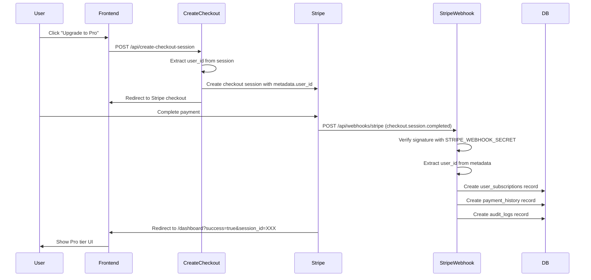

# Payment Integration Diagnosis Report

**Date:** October 11, 2025  
**Issue:** UI doesn't update after test payment, no records in `payment_history` or `user_subscriptions` tables

## Root Cause Analysis

### Primary Issues Identified

#### 1. ❌ Missing Stripe API Keys (CRITICAL)

**Location:** `frontend/.env.local`

**Problem:**
```bash
STRIPE_SECRET_KEY=                    # ❌ Empty
STRIPE_WEBHOOK_SECRET=                # ❌ Empty
NEXT_PUBLIC_STRIPE_PUBLISHABLE_KEY=   # ✅ Set (but may be invalid)
```

**Impact:**
- Webhook signature verification will **always fail** without `STRIPE_WEBHOOK_SECRET`
- Cannot create customers or checkout sessions without `STRIPE_SECRET_KEY`
- Payment webhooks from Stripe are rejected, preventing subscription creation

**Evidence:** `frontend/src/app/api/webhooks/stripe/route.ts:29`
```typescript
const event = await fiatPaymentProvider.verifyWebhookSignature(
  body,
  signature,
  serverEnv.STRIPE_WEBHOOK_SECRET,  // ← This is empty!
);
```

#### 2. ⚠️ Database State

**Verified via diagnostic script:**
```
✅ subscription_tiers: 2 records (free, pro) - GOOD
✅ user_subscriptions: 1 record (dev-bypass) - Test data only
❌ payment_history: 0 records - CONFIRMS ISSUE
✅ users: 3 records - GOOD
```

**Interpretation:**
- Schema is deployed correctly
- Tiers are seeded properly
- No payment webhooks have successfully processed

#### 3. ⚠️ Webhook Endpoint Configuration Unknown

**Cannot verify without Stripe dashboard access:**
- Is webhook URL configured in Stripe?
- Is webhook URL publicly accessible (not localhost)?
- Which events are subscribed?
- Are webhooks being delivered at all?

**Required webhook events:**
- `checkout.session.completed`
- `customer.subscription.created`
- `customer.subscription.updated`
- `customer.subscription.deleted`
- `invoice.payment_succeeded`
- `invoice.payment_failed`

## Code Flow Analysis

### Expected Payment Flow



### Where the Flow Breaks

**Step 7-8:** Webhook signature verification fails because `STRIPE_WEBHOOK_SECRET` is empty.

**Result:** Webhook returns 401 Unauthorized, Stripe retries, eventually gives up.

**File:** `frontend/src/app/api/webhooks/stripe/route.ts:16-30`

```typescript
export async function POST(request: NextRequest) {
  try {
    const body = await request.text();
    const signature = request.headers.get("stripe-signature");

    if (!signature) {
      return NextResponse.json({ error: "No signature provided" }, { status: 400 });
    }

    const fiatPaymentProvider = getFiatPaymentProvider();
    
    // ❌ THIS FAILS: serverEnv.STRIPE_WEBHOOK_SECRET is empty
    const event = await fiatPaymentProvider.verifyWebhookSignature(
      body,
      signature,
      serverEnv.STRIPE_WEBHOOK_SECRET,
    );
    
    // Code below never executes...
  }
}
```

## Configuration Required

### Step 1: Configure Stripe API Keys

Add to `frontend/.env.local`:

```bash
# Get these from https://dashboard.stripe.com/test/apikeys
STRIPE_SECRET_KEY=sk_test_xxxxxxxxxxxxxxxxxxxxxxxxxxxxxxxxxxxxxxxxxxxxx

# Get publishable key from same page
NEXT_PUBLIC_STRIPE_PUBLISHABLE_KEY=pk_test_xxxxxxxxxxxxxxxxxxxxxxxxxxxxxxxxxxxxxxxxxxxxx

# Get webhook secret from https://dashboard.stripe.com/test/webhooks
# After creating webhook endpoint pointing to your app's /api/webhooks/stripe
STRIPE_WEBHOOK_SECRET=whsec_xxxxxxxxxxxxxxxxxxxxxxxxxxxxxxxxxxxxxxxxxxxxx
```

### Step 2: Configure Stripe Webhook Endpoint

1. Go to https://dashboard.stripe.com/test/webhooks
2. Click "Add endpoint"
3. Enter endpoint URL: `https://your-domain.com/api/webhooks/stripe`
   - For local testing: Use ngrok or similar tunnel
4. Select events to send:
   - `checkout.session.completed`
   - `customer.subscription.created`
   - `customer.subscription.updated`
   - `customer.subscription.deleted`
   - `invoice.payment_succeeded`
   - `invoice.payment_failed`
5. Copy the webhook signing secret and add to `.env.local`

### Step 3: Test Webhook Locally

For local development, use Stripe CLI:

```bash
# Install Stripe CLI
brew install stripe/stripe-cli/stripe

# Login to Stripe account
stripe login

# Forward webhooks to local server
stripe listen --forward-to localhost:3000/api/webhooks/stripe

# This will output a webhook secret like:
# whsec_xxxxx... (use this in .env.local)
```

## Additional Findings

### Code Quality Assessment

**Webhook Handler:** ✅ Well-structured
- Proper signature verification
- Good error handling with admin alerts
- User ID extraction with fallbacks
- Delegates to subscription service

**Subscription Service:** ✅ Comprehensive
- Handles all lifecycle events
- Creates both subscription and payment records
- Idempotency checks
- Audit logging
- Email notifications

**Database Schema:** ✅ Properly designed
- Foreign keys configured correctly
- Indexes for performance
- Audit trails included

**Known Code Issues:**

1. **No transaction wrapping** in webhook handlers (Risk: partial state)
   - Location: `subscription-service.ts:445-499`
   - Fix: Wrap subscription + payment creation in transaction

2. **Missing idempotency checks** on payment records
   - Location: `subscription-service.ts:660-703`
   - Fix: Check for existing `providerPaymentId` before inserting

3. **No UI refresh mechanism** after payment
   - Location: Dashboard page needs session verification endpoint
   - Fix: Implement `/api/verify-session` endpoint with retry logic

## Recommended Fixes (Priority Order)

### Priority 1: Critical Blockers

1. **Configure Stripe API keys** in `.env.local`
2. **Configure Stripe webhook endpoint** in dashboard
3. **Test webhook delivery** with Stripe CLI or test payment

### Priority 2: Code Improvements

4. **Add database transactions** for webhook handlers
5. **Add idempotency checks** for payment records
6. **Implement session verification** endpoint for UI refresh

### Priority 3: Observability

7. **Add structured logging** to webhook handlers
8. **Create monitoring dashboard** for webhook success rate
9. **Document troubleshooting** runbook

## Verification Steps

After configuring Stripe keys:

```bash
# 1. Verify environment variables loaded
cd frontend && node -e "require('dotenv').config({path:'.env.local'}); console.log('Stripe Secret:', process.env.STRIPE_SECRET_KEY?.substring(0,10) + '...');"

# 2. Run diagnostic script
node scripts/diagnose-payment-integration.js

# 3. Start dev server
pnpm dev

# 4. Test checkout flow
# - Visit http://localhost:3000/pricing
# - Click "Upgrade to Pro"
# - Complete payment with test card: 4242 4242 4242 4242
# - Check webhook logs in terminal
# - Verify subscription created: node scripts/diagnose-payment-integration.js

# 5. Check database
# Expected: 1 new record in user_subscriptions, 1 new record in payment_history
```

## Files Analyzed

- ✅ `frontend/src/app/api/webhooks/stripe/route.ts` - Webhook receiver
- ✅ `frontend/src/lib/services/subscription-service.ts` - Business logic
- ✅ `frontend/src/app/api/create-checkout-session/route.ts` - Checkout creation
- ✅ `frontend/src/lib/db/schema.ts` - Database schema
- ✅ `frontend/.env.local` - Environment variables
- ✅ Database tables via diagnostic script

## Conclusion

**The payment integration code is functionally correct.** The issue is purely configurational:

1. Stripe API keys are not configured
2. Webhook endpoint may not be configured in Stripe dashboard
3. Without these, webhooks cannot be received or verified

**Once the configuration is fixed, the existing code should work as designed.**
